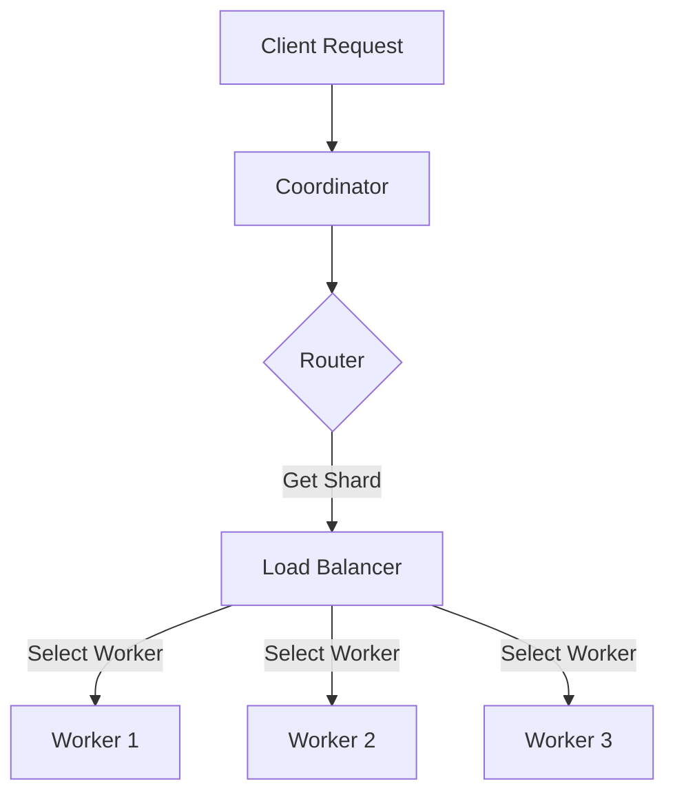

# Router vs Load Balancer

This document explains the differences between the Router and Load Balancer components in the Distributed Inference Engine.

## Overview

Both the Router and Load Balancer are responsible for request distribution, but they serve different purposes and operate at different levels of the system.

## Router

### Purpose
- Manages model-to-worker mapping based on sharding logic
- Ensures consistent request routing for the same key
- Handles model versioning and shard management

### Key Features
- **Consistent Hashing**: Routes requests to the same shard based on a request key
- **Model/Shard Awareness**: Knows which workers serve which model shards
- **Failover Support**: Can route to backup shards when primary shards are unavailable
- **Shard Management**: Handles adding/removing shards and rebalancing

### When to Use
- When you need to ensure the same request key always goes to the same worker (e.g., for caching or session affinity)
- When working with sharded models where different workers handle different parts of the model
- When you need fine-grained control over which worker handles which requests

## Load Balancer

### Purpose
- Distributes load evenly across worker nodes
- Monitors worker health and performance
- Provides different load distribution strategies

### Key Features
- **Multiple Strategies**: Round-robin, least connections, random, least latency
- **Health Monitoring**: Continuously checks worker health
- **Dynamic Worker Management**: Can add/remove workers at runtime
- **Performance Metrics**: Tracks request counts, latencies, and error rates

### When to Use
- When you want to distribute load evenly across identical workers
- When you need automatic failover for worker failures
- When you want to maximize resource utilization across workers

## How They Work Together



1. The Coordinator receives a request and asks the Router which shard should handle it
2. The Router determines the appropriate shard based on the request key and model
3. The Load Balancer selects the best worker for that shard based on the current load
4. If a worker fails, the Load Balancer automatically routes to another healthy worker
5. If no healthy workers are available, the Router can fail over to a backup shard

## Example Use Cases

### Router-Centric Flow
```python
# When you need to ensure consistent routing
shard = router.route_request(
    model_name="recommendation-model",
    version="1.0",
    request_key="user-123"  # Same user always goes to same shard
)
```

### Load Balancer-Centric Flow
```python
# When you just need any available worker
worker = await load_balancer.get_worker()
# Send request to worker
```

## Summary Table

| Feature               | Router                          | Load Balancer                     |
|-----------------------|---------------------------------|-----------------------------------|
| **Primary Goal**      | Consistent request routing      | Even load distribution            |
| **Key Mechanism**     | Hash-based sharding            | Various balancing strategies      |
| **State Management**  | Tracks model/shard assignments  | Tracks worker health/load         |
| **Failure Handling**  | Fails over to backup shards     | Removes unhealthy workers         |
| **Best For**          | Stateful, sharded workloads    | Stateless, horizontally scalable  |
